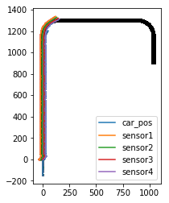
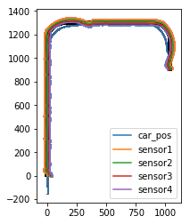

# RL-WorkShop
2020/08/24予定  
RDCLab.のB3に向けた勉強会の資料です。  
ライントレースカーの簡単なシミュレーターを、PID制御などは使わずに強化学習だけで制御してみます。  

## 必要なライブラリ・環境
+ nyumpy
+ matplotlib
+ jupyter notebook
+ python3.x

## 制御のイメージ
<table>
    <tr>
        <td></td>
        <td></td>
    </tr>  
</table>
</td>

## 動画
  
